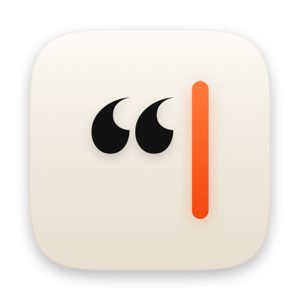
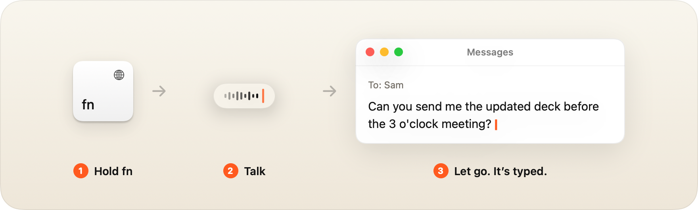
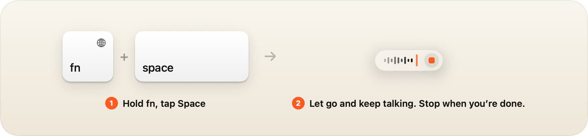
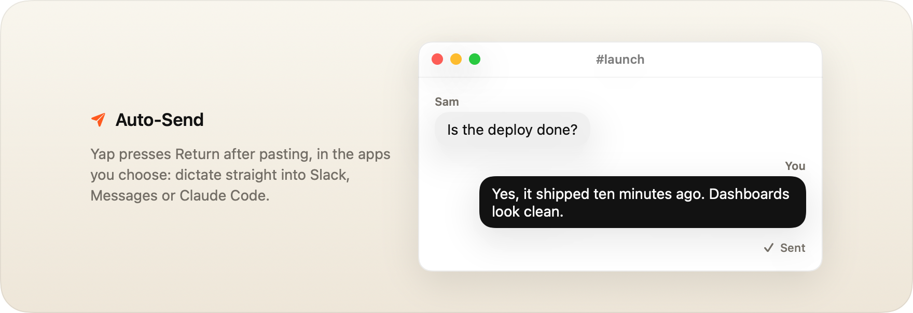
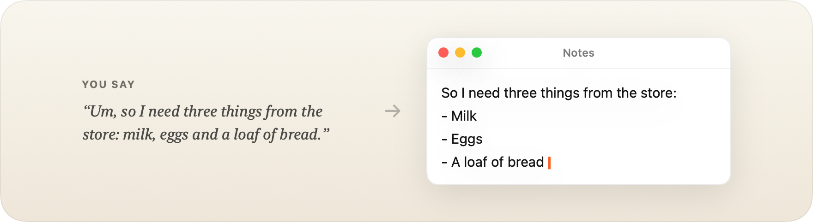
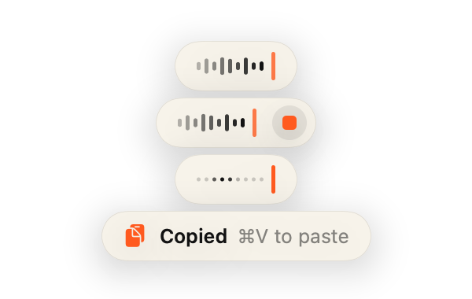

<p align="center">
  
</p>

<h1 align="center">yap</h1>

<p align="center">
  Hold a key, talk, let go. Your words land where you are typing.<br>
  Local dictation for macOS, transcribed in about 50 ms on your Mac's Neural Engine.
</p>

<p align="center">
  <picture>
    <source media="(prefers-color-scheme: dark)" srcset="docs/images/pill-dark.png">
    
  </picture>
</p>

<p align="center">
  <a href="LICENSE"></a>
  
</p>

<p align="center">
  
</p>

- **Local.** Speech never leaves your Mac. The only network request is the one-time model download.
- **Fast.** NVIDIA Parakeet on the Neural Engine turns a 5 second sentence into text in about 45 ms.
- **Goes where you type.** Pastes into the focused text field, or copies to the clipboard when nothing editable has focus.
- **Knows your words.** Names and jargon on screen (Supabase, shadcn, your teammates) come out spelled right.
- **Tidy output.** Filler words and stutters are removed, spoken lists become real lists, and "new line" and "scratch that" work.
- **Free and open source,** under the Apache 2.0 license.

## Install

You need macOS 14 or later on Apple Silicon, Node.js 20.11 or later, and the Xcode Command Line Tools (`xcode-select --install`).

```sh
npm install -g github:xrehpicx/yap
yap start
```

The first `yap start` compiles the app, which takes a few minutes. It then downloads the speech model (about 450 MB), and macOS asks for two permissions:

- **Microphone**, to hear you.
- **Accessibility**, to notice the hotkey and paste into the app you are using.

`yap doctor` checks the whole setup and tells you what to fix. `yap install` starts Yap at login. To update, run the install command again; the next `yap` command rebuilds the app.

## Use

Hold **fn**, speak, release.

| Where your cursor is | What happens |
| --- | --- |
| A text field | The text is pasted there. Your clipboard is left as it was. |
| Nothing editable | The text is copied, and the pill says **Copied ⌘V to paste**. |
| An app that hides its text fields (some Electron apps and terminals) | Yap pastes and also leaves the text on the clipboard, so nothing is lost. |

Press **Esc** while recording to cancel. If a dictation went somewhere unexpected, find it under **Recent Dictations** in the menu bar, or run `yap history`.

### Hands-free

While holding fn, tap **Space**. Let go and keep talking; stop with the button on the pill or another tap of fn.

<p align="center">
  
</p>

### Auto-send

Yap can press Return after pasting, so dictating into Slack or Claude Code sends the message. In the menu bar choose **Auto-Send**, then the app in front or **In Every App**. From the terminal: `yap send add Slack`.

<p align="center">
  
</p>

## Screen context

Parakeet has never heard of your teammates or your stack. When you start talking, Yap reads the words visible in the front window and picks out the unusual ones: names, products, identifiers. If the transcript contains something that looks like a mishearing of one of them, Yap checks it against the audio with a second, small model and corrects it only if the sound agrees.

| On screen | Parakeet heard | You get |
| --- | --- | --- |
| Supabase, Vercel | "the superbase and Versal migration" | the Supabase and Vercel migration |
| shadcn | "a PR in the Shaden repo" | a PR in the shadcn repo |
| FluidAudio | "whether Fluid Audio runs" | whether FluidAudio runs |

Phrases on screen are also matched by sound: with `yap logs` visible, "Yeah, plugs" becomes yap logs, and "open div" becomes open diff. A single ordinary word is never swapped for another, so "the locks" stays "the locks" even with "the logs" on screen.

Identifiers are matched by their letters and digits: with `RE-727` or `python3` on screen, saying "re seven two seven" or "python three" gives exactly `RE-727` or `python3`, instantly.

Everyday words are only replaced when the audio strongly suggests it: "refactor" stays "refactor" even with React on screen, while "change lock" becomes changelog. Reading the screen happens while you talk, so dictations with nothing to correct are exactly as fast as before; a dictation that does get a correction takes about 150 ms longer. The screen text stays in memory and is never stored or logged.

Words you always want recognised, whatever is on screen: `yap config set vocabulary '["xrehpicx", "Priya"]'`. Turn screen reading off with **Use Screen Context** in the menu bar or `yap config set screenContext false`. The first time it is used, Yap downloads the small model it needs (106 MB).

## Formatting

Parakeet already writes punctuation, capitals and numbers ("$25", "3 o'clock"). Yap tidies what it leaves verbatim.

<p align="center">
  
</p>

| You say | You get |
| --- | --- |
| "Um, so we should, uh, ship it" | So we should ship it |
| "The the build failed" | The build failed |
| "I need three things from the store: milk, eggs and bread" | I need three things from the store:<br>- Milk<br>- Eggs<br>- Bread |
| "Three things. One milk, two eggs, three bread." | Three things:<br>1. Milk<br>2. Eggs<br>3. Bread |
| "First, refactor. Second, migrate." | 1. Refactor<br>2. Migrate |
| "Dear team, new paragraph, it shipped, new line, thanks, Raj" | Dear team,<br><br>It shipped.<br>Thanks, Raj |
| "Meet at five, scratch that, meet at six" | Meet at six |
| "Does it pass question mark" | Does it pass? |
| "Look at seven two seven, it's a four oh four" | Look at 727, it's a 404 |
| "The window is one twenty eight k" | The window is 128k |

These are plain text rules, not a language model, so they take about 0.2 ms. Turn them off with **Format Text** in the menu bar or `yap config set format false`.

## Menu bar

<picture>
  <source media="(prefers-color-scheme: dark)" srcset="docs/images/menubar-dark.png">
  
</picture>

Ready, listening, transcribing, needs attention (a permission is missing), and off. The switch at the top of the menu turns Yap off without quitting: the hotkey goes back to macOS, nothing reads the screen, and the microphone is released. The model stays loaded, so turning it back on is instant. Below the switch are the status, recent dictations, and switches for formatting, auto-send and sounds.

<picture>
  <source media="(prefers-color-scheme: dark)" srcset="docs/images/pill-states-dark.png">
  
</picture>

The pill follows your system appearance: ink on paper in light mode, paper on ink in dark mode.

## Commands

| Command | What it does |
| --- | --- |
| `yap start` / `stop` / `restart` | Control the background app |
| `yap status` | Show state and permissions |
| `yap on` / `off` | Switch Yap on or off without quitting, like the menu's switch |
| `yap doctor` | Check the whole setup and say what to fix |
| `yap install` / `uninstall` | Start at login, or stop doing so |
| `yap hotkey [keys]` | Show or set the hotkey |
| `yap send` | List auto-send apps; `send add <app>`, `send remove <app>`, `send all`, `send off` |
| `yap model [id]` | List models, or switch to one |
| `yap config` | Print the config; `config set <key> <value>` changes it |
| `yap transcribe <file>` | Transcribe an audio file (`--model`, `--runs`, `--raw` to skip formatting, `--json`) |
| `yap download [model]` | Fetch a model ahead of time |
| `yap history [n]` | Show recent dictations, with what the model heard when formatting changed it |
| `yap logs [-f]` | Show the log |

## Hotkey

`yap hotkey right_option`, `yap hotkey ctrl+opt+space`, `yap hotkey f18`.

- A modifier on its own: `fn`, `ctrl`, `opt`, `cmd`, `shift`, or one side only, such as `right_option` or `left_command`.
- Modifiers plus a key: letters, digits, `space`, `tab`, `return`, `f1`–`f20`.

With a modifier-only hotkey, pressing any key other than Space while you hold it cancels the take, so shortcuts like fn+arrow keep working.

If you use **fn**, set System Settings → Keyboard → "Press 🌐 key to" to **Do Nothing**. `yap doctor` checks this.

## Configuration

Stored in `~/.config/yap/config.json`. Change it with `yap config set <key> <value>`; Yap restarts itself to pick it up.

| Key | Default | Meaning |
| --- | --- | --- |
| `hotkey` | `fn` | See above |
| `mode` | `hold` | `hold` records while the key is down. `toggle` starts on one press and stops on the next |
| `model` | `parakeet-v2` | See below |
| `paste` | `auto` | `auto` pastes into text fields and copies otherwise. `always` always pastes. `clipboard` only copies |
| `format` | `true` | Apply the formatting rules above |
| `sendApps` | `[]` | Bundle IDs of apps where Yap presses Return after pasting; `"*"` means every app |
| `screenContext` | `true` | Listen for unusual words visible on screen (see [Screen context](#screen-context)) |
| `vocabulary` | `[]` | Words to always listen for, such as names |
| `debug` | `false` | Also log the words picked from the screen, to see why a word was or was not corrected |
| `restoreClipboard` | `true` | Put your previous clipboard back after pasting into a text field |
| `trailingSpace` | `true` | Add a space after pasted text so consecutive dictations do not run together |
| `sounds` | `true` | Play a sound when recording starts and stops |
| `hud` | `true` | Show the pill at the bottom of the screen |
| `history` | `true` | Keep dictations in `~/Library/Application Support/yap/history.jsonl` |
| `replacements` | `{}` | Fix words the model gets wrong: `yap config set replacements '{"clod code": "Claude Code"}'` |

## Models

All are NVIDIA Parakeet models (0.6 B parameters), converted to Core ML by [FluidAudio](https://github.com/FluidInference/FluidAudio). They run on the Neural Engine and download from Hugging Face on first use. Switch with `yap model <id>`.

| Model | Languages | Download |
| --- | --- | --- |
| `parakeet-v2` (default) | English | 450 MB |
| `parakeet-ultra` | 25 European languages | 630 MB |
| `parakeet-v3` | 25 European languages | 480 MB |
| `parakeet-unified` | English | 600 MB |

Time from letting go of the key to having text, on an M4 Max:

| Clip | `parakeet-v2` | `parakeet-ultra` | Apple SpeechAnalyzer |
| --- | --- | --- | --- |
| 5 s | 45 ms | 51 ms | 100 ms |
| 14 s | 65 ms | 75 ms | 277 ms |
| 29 s | 100 ms | 151 ms | 450 ms |

On the same clips v2 got every technical term right (Redis, Kubernetes, PostgreSQL, TypeScript). [docs/models.md](docs/models.md) has the full comparison, including why Yap does not use Whisper.

## Privacy

Audio is recorded only while you hold the hotkey (or during a hands-free take). It is transcribed in memory and is never written to disk or sent anywhere. Transcripts stay on your Mac in `history.jsonl`, unless you turn history off. Yap has no analytics and no account.

The Accessibility permission is used for four things: noticing the hotkey, seeing whether a text field has focus, reading the words on screen for [screen context](#screen-context), and sending ⌘V and Return. Screen text stays in memory for the length of one dictation. Yap does not log keystrokes. See [SECURITY.md](SECURITY.md).

## Troubleshooting

- **Nothing happens when I hold fn.** Run `yap doctor`. Usually Accessibility is not granted yet, or "Press 🌐 key to" is set to something other than Do Nothing.
- **macOS asks for permissions again after updating.** Grants are tied to the app's code signature. Builds signed with a Developer ID or Apple Development certificate keep them. Ad-hoc builds (no certificate in your keychain) are asked again after every reinstall.
- **The text went somewhere else.** Open **Recent Dictations** in the menu bar, or run `yap history`.
- **A word on screen still comes out wrong.** Run `yap config set debug true`, dictate again, and `yap logs` lists the words Yap picked from the screen. If it is there, the transcript was too far from it to be sure; add a replacement for it.
- **A word keeps coming out wrong.** Add a replacement: `yap config set replacements '{"wrong": "right"}'`.
- **Something else.** `yap logs` shows what Yap did and how long each step took. Please include it when you [open an issue](https://github.com/xrehpicx/yap/issues).

## How it works

`yap` is a small Node CLI around `Yap.app`, a Swift menu bar app built from [`native/`](native). The app keeps the model loaded, watches the hotkey with an event tap, records with AVAudioEngine, transcribes with FluidAudio, formats the text, and pastes it. [docs/architecture.md](docs/architecture.md) walks through each step and the tricks that keep it fast.

## Contributing

Issues and pull requests are welcome. [CONTRIBUTING.md](CONTRIBUTING.md) covers building from source, running the tests, and regenerating the icon and images.

## License

Apache License 2.0; see [LICENSE](LICENSE) and [NOTICE](NOTICE). Speech models are downloaded separately and are licensed by their authors under CC-BY-4.0.

## Credits

- [NVIDIA Parakeet](https://huggingface.co/nvidia/parakeet-tdt-0.6b-v2) for the speech models.
- [FluidAudio](https://github.com/FluidInference/FluidAudio) for the Core ML conversions and the Swift runtime.
- [Wispr Flow](https://wisprflow.ai) for showing how good push-to-talk dictation can feel.
