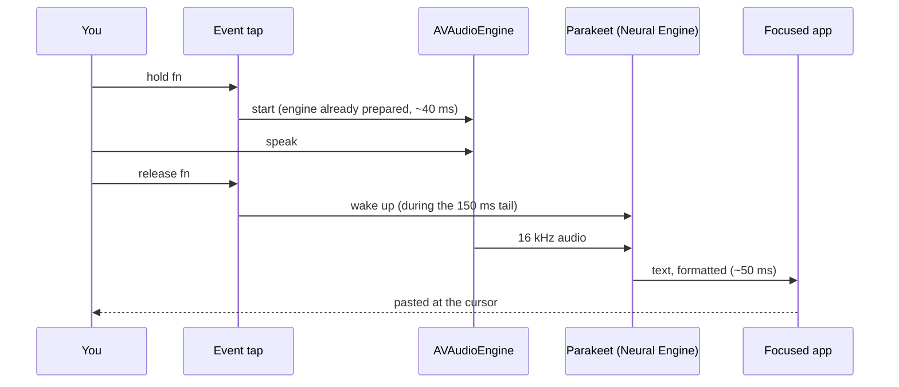

# How Yap works

Yap has two parts:

- **`bin/yap.js`**, a Node CLI with no dependencies. It starts and stops the app, edits the config, and runs one-off commands such as `yap transcribe`.
- **`Yap.app`**, a Swift menu bar app built from [`native/`](../native). It does the dictation.

The CLI launches the app with `open`, so macOS treats Yap as its own app. Microphone and Accessibility permissions belong to Yap, not to your terminal.

## One dictation

1. **Hotkey.** A session event tap watches key and modifier events. For a modifier-only hotkey such as fn, pressing another key while holding it cancels the take, so normal shortcuts keep working. Space instead locks the take into hands-free mode.
2. **Recording.** AVAudioEngine captures the default input device. The engine for the next take is built and prepared ahead of time, which halves the time to start capturing (about 40 ms instead of 100 ms). A prepared engine does not turn the microphone on. When the default input device changes, the prepared engine is rebuilt.
3. **The tail.** After you release the key, Yap keeps recording for 150 ms, so the end of your last word is not clipped. The Neural Engine slows down after a few idle seconds, so Yap runs a throwaway inference during those 150 ms. The real transcription then runs at full speed.
4. **Transcription.** FluidAudio runs Parakeet TDT on the Neural Engine. The model stays loaded between takes. Anything up to 15 seconds is a single encoder pass.
5. **Formatting.** [`Formatter.swift`](../native/Sources/yap-helper/Formatter.swift) applies plain text rules for fillers, stutters, spoken commands and lists. It takes about 0.2 ms.
6. **Delivery.** [`Inserter.swift`](../native/Sources/yap-helper/Inserter.swift) asks the Accessibility API what has focus:
   - A text field gets the text pasted with ⌘V, then your old clipboard is put back.
   - Something that is not a text field gets the text copied to the clipboard.
   - An app that does not say gets the text pasted and also left on the clipboard.

   ⌘V is sent for the key that types "v" in your current keyboard layout, so Dvorak and AZERTY work. With auto-send, Return follows 150 ms later.

## Files

| Path | What it is |
| --- | --- |
| `bin/yap.js` | The CLI |
| `scripts/build-native.mjs` | Builds the Swift package, wraps it in `dist/Yap.app`, and signs it |
| `scripts/postinstall.mjs` | Builds the app on install when no prebuilt copy is present |
| `scripts/make-icon.swift` | Draws the app icon |
| `native/Sources/yap-helper/App.swift` | Dictation state machine, menu bar menu |
| `native/Sources/yap-helper/Hotkey.swift` | Hotkey parsing and the event tap |
| `native/Sources/yap-helper/Recorder.swift` | Microphone capture |
| `native/Sources/yap-helper/Transcriber.swift` | Model loading and transcription |
| `native/Sources/yap-helper/Formatter.swift` | Text formatting rules |
| `native/Sources/yap-helper/Inserter.swift` | Focus detection, paste, clipboard |
| `native/Sources/yap-helper/HUD.swift` | The pill |
| `native/Sources/yap-helper/Icons.swift` | Menu bar glyphs |

## Where things live

| Path | Contents |
| --- | --- |
| `~/.config/yap/config.json` | Settings |
| `~/Library/Application Support/yap/history.jsonl` | Dictation history |
| `~/Library/Application Support/yap/state.json` | Live status, read by `yap status` |
| `~/Library/Logs/yap/yap.log` | Log |
| `~/Library/Application Support/FluidAudio/Models/` | Downloaded models |
| `~/Library/LaunchAgents/com.yap-dictate.helper.plist` | Login item, after `yap install` |
